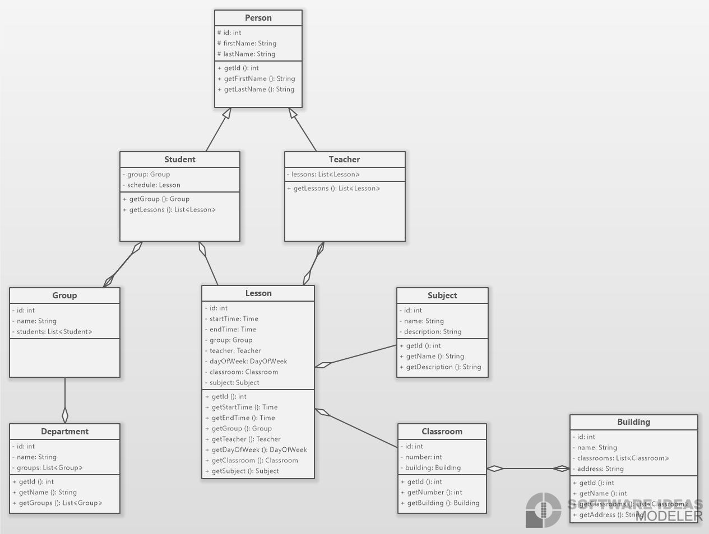

# University CMS

## Diagram
    

## Features

### Student can view own schedule flow

Given user is logged on as Student

- User can select `My Education` menu
- From the dropdown menu, user can choose `My Schedule` menu
- User should see own Student schedule according to selected date/range filter

### User can edit own personal data

Given user is logged on

- User can see and navigate to `My Profile` menu
- User should see own Personal Data and user can edit it

### Teacher can view own schedule flow

Given user is logged on as a Teacher

- User can see and navigate to `My Schedule` menu
- User should see own Teacher schedule according to selected date/range filter

