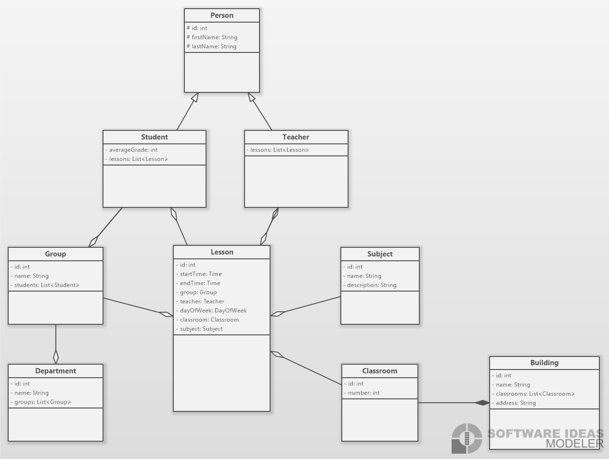

# University CMS

## Diagram
    

## Features

### Student can view own schedule flow

Given user is logged on as Student

- User can select `My Education` menu
- From the dropdown menu, user can choose `My Schedule` menu
- User should see own Student schedule according to selected date/range filter

### User can edit own personal data

Given user is logged on

- User can see and navigate to `My Profile` menu
- User should see own Personal Data and user can edit it

### Student can view own grades

Given user is logged on as a Student

- User can select `My Education` menu
- From the dropdown menu, user can choose `My Grades` menu
- User should see own Student grades according to selected teacher/subject/semester/field of subject filter
- User can see own average grade according to selected teacher/subject/semester/field of subject filter

### Student can view own status

Given user is logged on as a Student

- User can see and navigate to `My Profile` menu 
- User should see own educational status
- If student was expelled, he should see date and reason

### Student can view own retakes

Given user is logged on as a Student

- User can select `My Education` menu
- From the dropdown menu, user can choose `My Retakes` menu
- User can see own retakes
- If student get 3 retakes, he expels

### Student can view own enrollment

Given user is logged on as a Student

- User can see and navigate to `My Profile` menu
- User should see own enrollment

### Teacher can view own schedule flow

Given user is logged on as a Teacher

- User can see and navigate to `My Schedule` menu
- User should see own Teacher schedule according to selected date/range filter

### Teacher can grade the student

Given user is logged on as a Teacher

- User can see and navigate to `Grades` menu
- User should see list of groups
- User can choose group and grade student from the list in the subject he teaches
- If grade is less than minimal, student is credited with a retake 

### Dean can edit group's schedule

Given user is logged on as Dean

- User can see and navigate to `Schedule` menu
- User should see list of groups
- User can choose group and edit schedule

### Dean can edit teacher's schedule

Given user is logged on as Dean

- User can see and navigate to `Schedule` menu
- User should see list of teachers
- User can choose teacher and edit schedule

### Admin can edit user's information

Given user is logged on as an Admin

- User can see and navigate to `Managment` menu
- User can see list of all users and their information
- User can select one and edit information

